<div align="center">

# ⚡ AETHER NOC

### AI-Powered Network Operations Center


<br>

[](https://aether-noc-frontend.onrender.com)

[](https://aether-noc-backend.onrender.com/docs)

[](https://github.com/Bhanureddy-05/AI-Powered-NOC-Platform)

</div>

---

# 🎯 About

AETHER NOC is a full-stack monitoring platform that provides:

✅ Real-Time Device Monitoring

✅ Intelligent Alert Management

✅ Machine Learning Anomaly Detection

✅ Ticket Management

✅ Health Score Analytics

✅ PDF & CSV Reporting

Built using modern technologies to demonstrate real-world software engineering, cloud deployment, and applied machine learning.

---

# 🖼️ Dashboard Preview

<p align="center">

</p>

---

# ✨ Features

| Feature | Description |
|----------|-------------|
| 📡 Device Monitoring | Monitor device health and status |
| ⚡ Live Updates | WebSocket-powered real-time updates |
| 🚨 Alert Engine | Automatic alert generation |
| 🔄 Alert Deduplication | Prevent alert storms |
| 🎫 Ticket Management | Incident tracking workflow |
| 🤖 ML Detection | Isolation Forest anomaly detection |
| 📊 Analytics | Historical metrics and trends |
| 📄 Reports | PDF and CSV export support |
| 🔐 Security | JWT Authentication & RBAC |

---

# 🏗️ Architecture

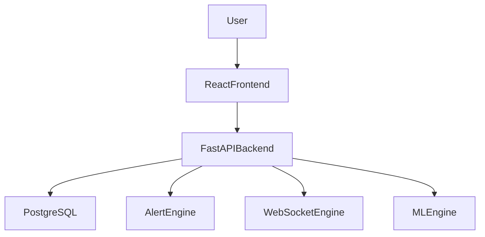

---

# 🛠️ Tech Stack

### Frontend

- React
- Vite
- Tailwind CSS
- Recharts

### Backend

- FastAPI
- SQLAlchemy
- JWT Authentication
- WebSockets

### Database

- PostgreSQL
- SQLite

### Machine Learning

- Isolation Forest
- Random Forest
- Scikit-Learn

### Deployment

- Render

---

# 📊 Project Screenshots

---

## 🔐 Login

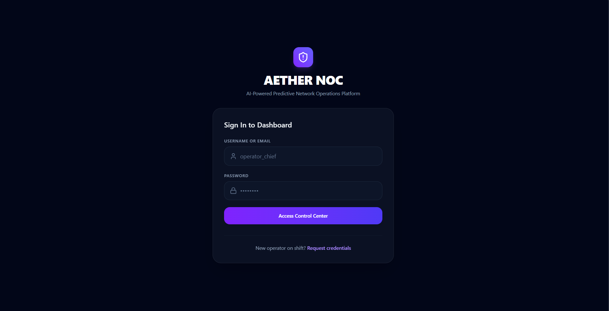

---

## 👥 User Management

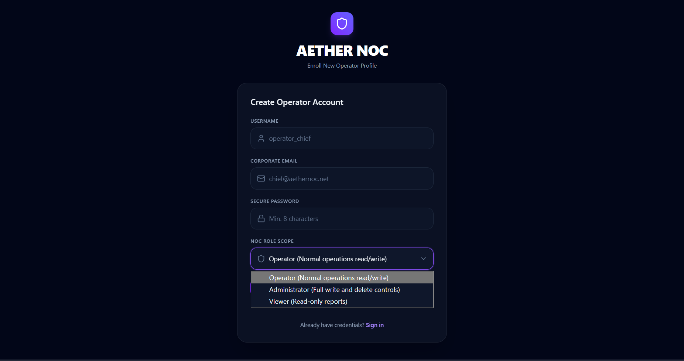

---

## 📊 Dashboard

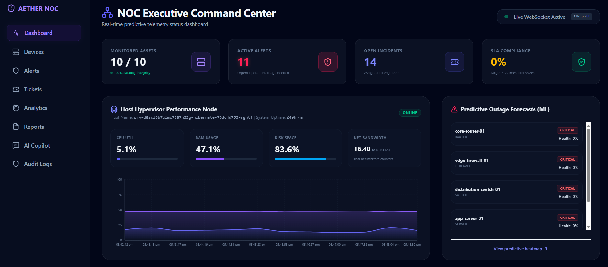

---

## 🌐 Live Device Catalog

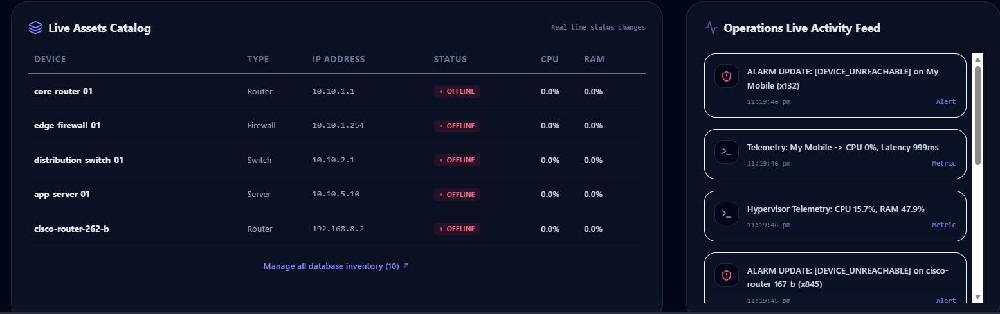

---

## 🖥 Device Management

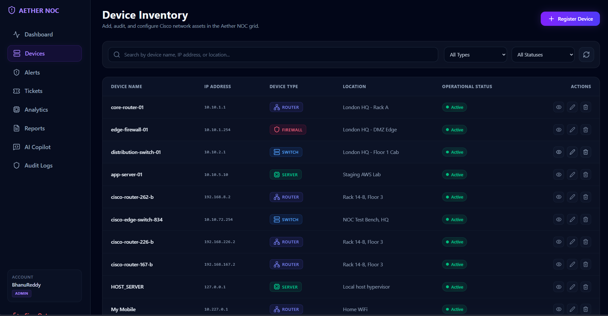

---

## 🚨 Alert Management

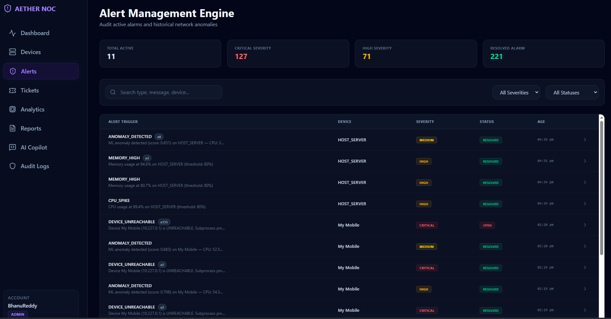

---

## 🎫 Incident Ticket Management

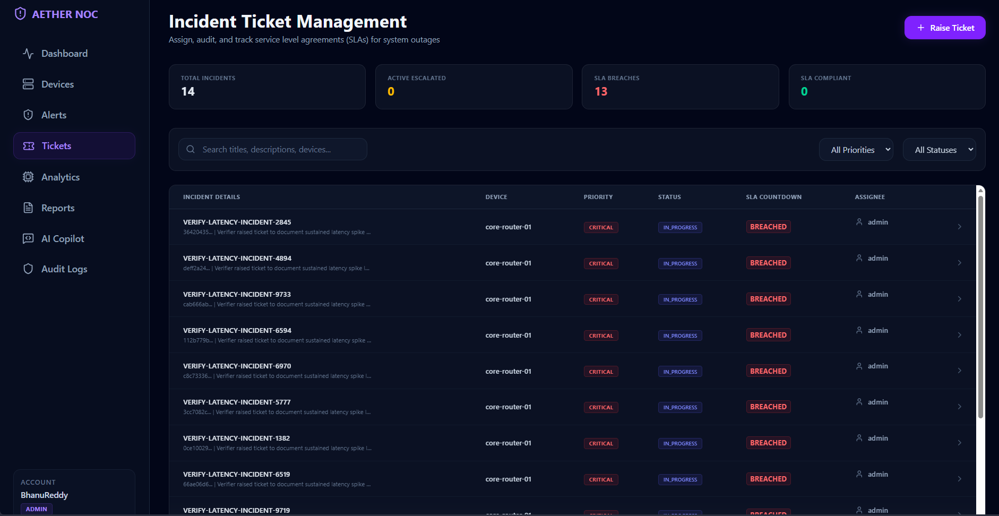

---

## 📈 Analytics Dashboard

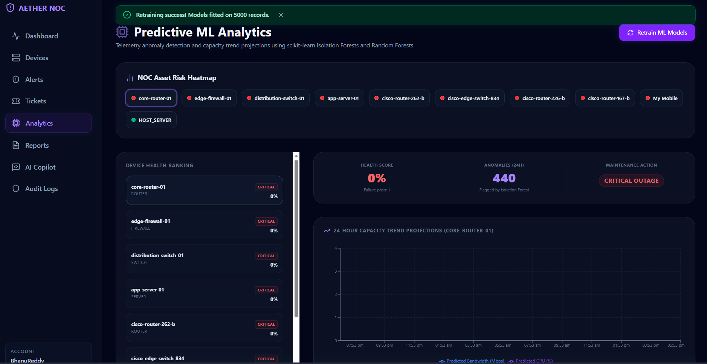

---

## 🤖 AI Copilot

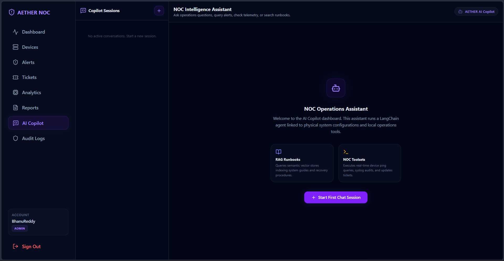

---

## 📄 Reports

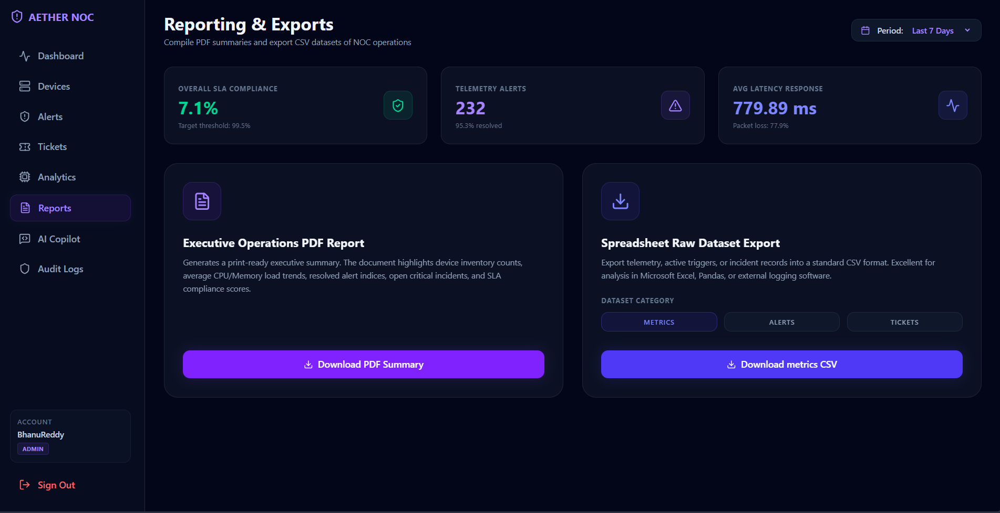

---

## 🛡 Security Audit Logs

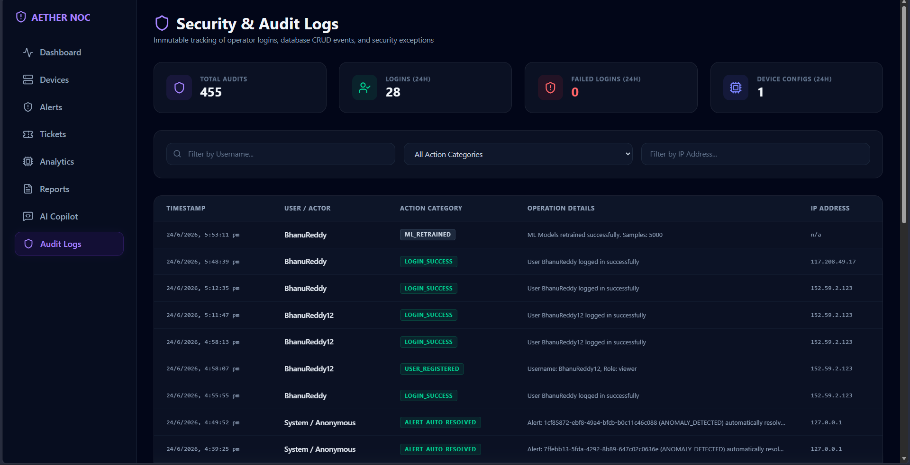

---


# 🚀 Quick Start

## Backend

```bash
cd backend

pip install -r requirements.txt

uvicorn main:app --reload
```

## Frontend

```bash
cd frontend

npm install

npm run dev
```

---

# 🌍 Deployment

### Frontend

YOUR_FRONTEND_URL

### Backend

YOUR_BACKEND_URL

### API Docs

YOUR_BACKEND_URL/docs

---

# 🎓 Skills Demonstrated

- Full Stack Development
- Backend Engineering
- Machine Learning
- REST APIs
- WebSockets
- Database Design
- Authentication & RBAC
- Cloud Deployment
- Software Architecture

---

# 🔮 Future Enhancements

- SNMP Monitoring
- Network Discovery
- Docker Deployment
- Kubernetes Support
- Topology Visualization

---

<div align="center">

## ⭐ Star This Repository

If you found this project useful, consider giving it a star.

Built with ❤️ by **Bhanu Reddy**

</div>
